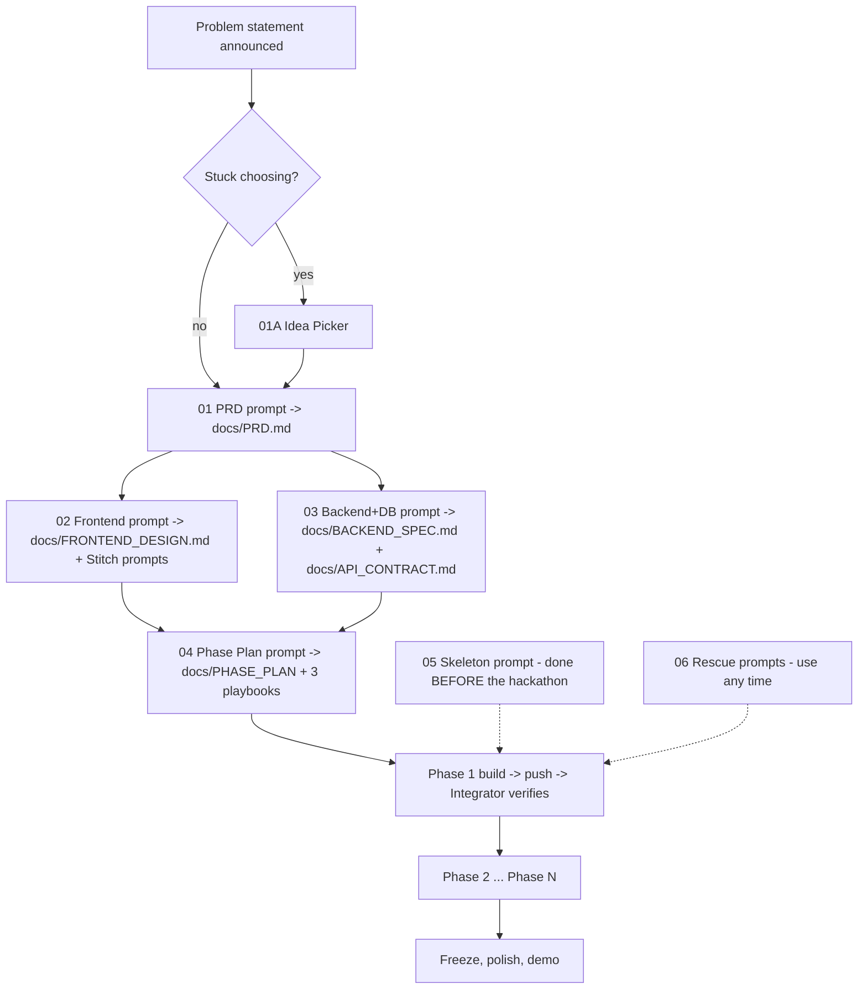

# CYPHER 4.0 Hackathon Kit: START HERE

A 24-hour, space-themed hackathon. Team of **3 beginners**. Judged on **innovation, technical complexity, execution, practicality, presentation**.

This kit lets the team "vibe code" a polished, working, deployed project by pasting prompts into an AI agent (Claude, Antigravity, Copilot, etc.), in a fixed order, without breaking each other's work.

**Locked stack**
| Layer | Tool |
|---|---|
| Frontend | React + Vite + Tailwind CSS (v4), designed in Google Stitch first |
| Backend | Python **FastAPI** + **PyMongo** |
| Database | **MongoDB Atlas** (free M0) |
| Hosting | **Vercel** (frontend) + **Render** (backend), both auto-deploy when code is pushed to `main` |
| Source control | GitHub, one repo, everyone pushes to `main` but only edits their own folder |

---

## 1. The Big Picture



The skeleton (05) is built and deployed **before** the hackathon. On the day, the team starts from a working, deployed app and only adds project code.

---

## 2. Prompt Map: which prompt, when, by whom

| # | File | When | Who runs it | Paste in | Output (save in `/docs`) |
|---|---|---|---|---|---|
| 05 | `05_SKELETON_PROMPT_ANTIGRAVITY.md` | **Before** the hackathon | Integrator (with helper) | Antigravity | Working repo, deployed, auto-deploy on |
| 01A | `01A_IDEA_PICKER_PROMPT.md` | Hour 0, only if stuck | Everyone together | Any Claude chat | Chosen idea + 1-page pitch |
| 01 | `01_PRD_MASTER_PROMPT.md` | Hour 0-1 | Integrator | Any Claude chat | `PRD.md` |
| 02 | `02_FRONTEND_MASTER_PROMPT.md` | Hour 1-2 | Frontend dev | Any Claude chat | `FRONTEND_DESIGN.md` (+ Stitch prompts) |
| 03 | `03_BACKEND_DB_MASTER_PROMPT.md` | Hour 1-2 | Backend dev | Any Claude chat | `BACKEND_SPEC.md`, `API_CONTRACT.md` |
| 04 | `04_PHASE_PLAN_MASTER_PROMPT.md` | Hour 2-3 | Integrator | Any Claude chat | `PHASE_PLAN.md`, `FRONTEND_PLAYBOOK.md`, `BACKEND_PLAYBOOK.md`, `INTEGRATOR_PLAYBOOK.md` |
| 06 | `06_RESCUE_PROMPTS.md` | Any time | Whoever is stuck | Agent | Fix / unblock |

**How to use a master prompt (every time):**
1. Open a **new** chat with a strong model (Claude preferred).
2. Copy everything inside the code block of the prompt file.
3. Paste it, then paste the required input docs where the prompt says `<paste here>`.
4. Send. Read the answer. If something is unclear, reply "Explain section X in simple words".
5. Save the answer as the named `.md` file in `/docs`, commit and push.

If the answer is cut off, reply: "Continue exactly where you stopped."

---

## 3. Roles (3 people)

| Role | Owns | Folder | Daily job |
|---|---|---|---|
| **Frontend Dev** | Design in Stitch, React pages, calling the API | `/frontend` | Build pages, connect them to the backend phase by phase |
| **Backend Dev** | API, database, seed data, smart features | `/backend` | Build the API in phases, keep `/docs` (Swagger) page working |
| **Integrator** | PRD, API contract, merging checks, deployment, QA, bug triage, demo & pitch | `/docs`, root files, `/scripts` | After every push: check the deployed app, test flows, report bugs, own the demo |

**Golden rules**
- Nobody edits another person's folder. If you need a change there, ask them (or the Integrator) in the chat.
- Only the **Integrator** changes `/docs/API_CONTRACT.md`, after both devs agree.
- The Integrator is the "bug keeper": all bugs go to a shared list (`docs/BUGS.md`) and are assigned to Frontend or Backend.

---

## 4. Prerequisites (do these days before the hackathon)

### 4.1 Accounts (everyone unless stated)
| Account | Who | Verify |
|---|---|---|
| GitHub | Everyone | Can open github.com and see profile |
| Google (for Stitch) | Frontend dev | Opens stitch.withgoogle.com and can start a project |
| MongoDB Atlas | Integrator (one account is enough) | Dashboard loads |
| Render | Integrator | Dashboard loads (sign in with GitHub) |
| Vercel | Integrator | Dashboard loads (sign in with GitHub) |
| AI API key (Gemini/Claude/etc.) | Decide later, one person holds it | Not needed for the skeleton |

### 4.2 Software on every laptop (Windows)
Open **PowerShell** and run each command. Expected result is shown.

| Tool | Install | Verify command | Expected |
|---|---|---|---|
| VS Code | code.visualstudio.com | open it | opens |
| Git | git-scm.com (default options) | `git --version` | `git version 2.x` |
| Node.js LTS (20 or 22) | nodejs.org, choose LTS | `node -v` and `npm -v` | `v20.x` or higher, npm `10.x` |
| Python 3.11 or 3.12 | python.org; **tick "Add python.exe to PATH"** in the installer | `python --version` | `Python 3.11.x` or `3.12.x` |
| Antigravity (or chosen agent) | per its website, sign in | open a folder and chat once | agent replies |

Python note: if `python` says "not found" or opens the Microsoft Store, re-run the installer and tick the PATH box, or try `py --version`.

PowerShell script permission (needed to activate Python virtual environments): run once
```powershell
Set-ExecutionPolicy -Scope CurrentUser -ExecutionPolicy RemoteSigned
```
Expected: no output (answer `Y` if asked).

### 4.3 Git setup (everyone, once)
```powershell
git config --global user.name "Your Name"
git config --global user.email "you@example.com"
```
Check: `git config --global --list` shows both.

### 4.4 Skeleton rehearsal (the most important prerequisite)
1. Integrator runs prompt **05** in Antigravity and completes the dashboard checklist it prints.
2. Everyone clones the repo and starts both apps locally (steps are in the repo `README.md`).
3. Each person makes a tiny change in their own folder, pushes to `main`, and confirms it appears on the deployed site within a few minutes.

If this rehearsal works, the biggest setup risks are already gone.

---

## 5. Hackathon day flow (24h)

| Hours | Phase | What happens | Who | Checkpoint |
|---|---|---|---|---|
| 0:00-0:30 | Understand | Read problem statement together. Stuck? Run 01A. | All | Team can say the idea in 2 sentences |
| 0:30-1:30 | PRD | Run 01, review, approve | Integrator leads, all read | `docs/PRD.md` pushed |
| 1:30-3:00 | Specs | Run 02 (Frontend), 03 (Backend+DB) in parallel, then 04 | FE / BE / Integrator | All docs in `/docs`, playbooks ready |
| 3:00-4:00 | Stitch | Frontend dev generates all page designs in Stitch while Backend starts Phase B1 | FE / BE | Stitch screens exported to `/frontend/stitch-export` |
| 4:00-16:00 | **Build phases** | Phase 1, 2, 3... Each phase: build, push, Integrator verifies on deployed URLs, then next phase | All | Each phase's "done when" passes |
| 16:00-18:00 | Harden | Empty/loading/error states, seed data, bugs | All | Wow flow works on live URLs |
| 18:00 | **FEATURE FREEZE** | No new features after this | All | |
| 18:00-21:00 | Polish | Animations, responsive checks, copy | FE leads, Integrator QA | Looks good on laptop + phone |
| 21:00-23:00 | Demo prep | Pitch, slides, backup video, rehearse x3 | Integrator leads | Demo under 4 minutes |
| 23:00-24:00 | Buffer | Only fix emergencies | All | |

Times are relative to the start. The Phase Plan prompt (04) turns this into clock times and tasks.

---

## 6. Daily Git routine (everyone pushes to `main`)

Because each person only edits their own folder, conflicts are rare. Follow this loop every 30-60 minutes:

```powershell
git pull --rebase          # 1. get others' work FIRST
# ... make a small change, test it ...
git add .                  # 2. stage your changes
git commit -m "backend: add missions list endpoint"   # 3. describe it (area: what)
git pull --rebase          # 4. pull again just before pushing
git push                   # 5. push; Render/Vercel auto-deploy
```

Expected after `git push`: lines ending with `main -> main`. In 1-5 minutes the deployed apps update.

Rules:
- Commit message format: `frontend: ...`, `backend: ...`, `docs: ...`, `fix: ...`.
- **Never push code that doesn't start.** Run it locally first.
- Never commit `.env`. It is git-ignored; `.env.example` shows what is needed.
- If `git pull --rebase` says there is a conflict: stop and ask the Integrator (or use the rescue prompt R7).
- Bad push? Tell the Integrator immediately; they can revert with `git revert <commit>`.
- A free GitHub Action (CI) runs on every push and shows a red cross on GitHub if the backend fails to import or the frontend fails to build. A red cross means: fix now.

---

## 7. "I'm Stuck" Guide

| Problem | What to do |
|---|---|
| **Don't understand the problem statement** | Run 01A and use "Explain the problem like I'm 15" first. Spend max 30 minutes. |
| **Too many ideas / can't choose** | 01A scores ideas; pick the winner. Rule: choose the idea that can be demoed in 90 seconds. |
| **Idea feels too big** | Rescue R4 "Cut scope". Keep only MUST features. |
| **Stitch designs look inconsistent** | Generate the Style Seed screen first and attach its screenshot as reference for every other screen. Max 3 hours in Stitch. |
| **Agent changed too much / broke things** | Rescue R2, then `git restore .` (undo uncommitted changes) or `git revert`. |
| **Red error and no idea why** | Rescue R1: paste the full error, ask for a simple explanation + smallest fix. |
| **Backend: "Atlas connection / bad auth / timeout"** | Rescue R5. Usual causes: wrong password, special characters in password, IP not allowed (use `0.0.0.0/0`), missing DB name. |
| **Frontend: CORS error in browser console** | Rescue R6. Backend `CLIENT_ORIGINS` must include the frontend URL. |
| **Deployed site slow the first time** | Render free tier sleeps. First request takes up to ~1 minute. Open the backend `/health` URL before demoing. |
| **Deployment failed** | Open Render/Vercel logs, copy the last 30 lines, use Rescue R8. |
| **Frontend and backend disagree on data** | The API contract wins. Integrator decides which side to fix. |
| **Behind schedule** | Rescue R4: drop COULD then SHOULD features, never the wow flow. |
| **Demo is failing live** | Switch to the backup video (recorded at hour 20). Rescue R9 has the script. |
| **Merge conflict** | Rescue R7. |
| **Totally lost** | Rescue R10 "Resume": new chat that reads docs and tells you the next task. |

---

## 8. FAQ

**Do we need to understand all the code?** No, but you must understand the *flow*: browser → frontend → API → database → back. The PRD explains it in plain words. Ask the agent "explain this file simply" any time.

**Why Stitch first?** Designing visually first gives the agent a precise target. It's faster than describing UI in words.

**Why can the Integrator edit docs but not code?** To keep a clear owner for each thing. The Integrator tests like a user; if they find a bug they assign it, they don't fix it in someone else's folder.

**Can we change the plan mid-way?** Small changes yes, via the Integrator who updates the docs. Big changes no, after hour 8.

**What if the problem needs ML?** Tell the PRD prompt. Start simple: call a hosted AI API from the backend (the free Render machine is small). Decide with the Integrator and update the Backend spec.

**What is `/docs` vs the FastAPI `/docs` page?** `/docs` folder = our written documents. `https://<backend-url>/docs` = the automatic API testing page.

---

## 9. Final repo layout

```
cypher-project/
├─ AGENTS.md / CLAUDE.md / GEMINI.md   # same rules for whichever agent is used
├─ PROGRESS.md                          # agent updates after each task
├─ README.md
├─ render.yaml                          # backend deploy config
├─ .github/workflows/ci.yml             # automatic checks on push
├─ scripts/smoke-test.ps1               # Integrator's quick "is it alive" test
├─ docs/                                # PRD, specs, playbooks, BUGS.md
├─ backend/                             # FastAPI + PyMongo (Backend Dev)
│  ├─ app/{main.py, config.py, db.py, routers/, schemas/, services/}
│  ├─ seed.py
│  ├─ requirements.txt
│  └─ .env.example
└─ frontend/                            # React + Vite + Tailwind (Frontend Dev)
   ├─ src/{pages, components, api, mocks, styles}
   ├─ stitch-export/
   ├─ vercel.json
   └─ .env.example
```
