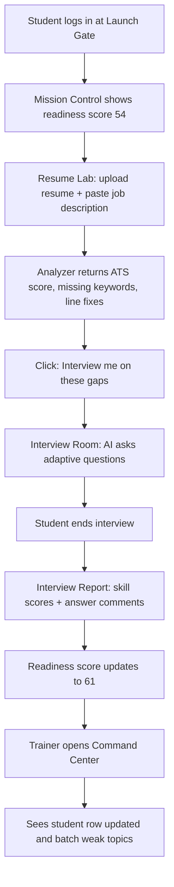
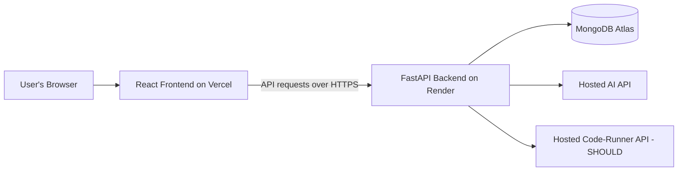

# Apogee: Product Requirements Document

> Hackathon: CYPHER 4.0 (24 hours, space theme). Problem 2: Placement Training LMS for College Students.
> Team: 3 beginners using AI coding agents. Real build time: about 14-16 hours.
> Stack (fixed): React + Vite + Tailwind | FastAPI + PyMongo | MongoDB Atlas | Vercel + Render.

---

# 0. Read This First (plain-language summary)

## What we are building
Apogee is a website where college students prepare for job placements in one place. A student uploads their resume, and the app tells them exactly which lines are weak and which skills are missing for a job they paste in. Then an AI interviewer asks questions about those exact gaps and asks follow-ups based on how the student answers. The student can also take timed multiple-choice tests that show their weak topics. Every activity updates one number, the **Launch Readiness Score**, and trainers see every student's score and weak areas on their own screen.

## Who it helps and why it matters
Final-year students often do not know what they are weak at until they fail a real interview. Trainers and placement officers handle hundreds of students with spreadsheets and guesswork. Apogee gives students honest feedback early and gives colleges a live picture of who is ready and who needs help.

## What the judges will see in 90 seconds
A student's resume gets scored against a job description, and the missing skills are highlighted. The AI interviewer then asks a follow-up that clearly reacts to the student's answer, and a feedback report appears. The student's readiness score jumps on the dashboard, and the trainer's screen shows the same student's updated row immediately.

## What we are NOT building
- Not a video-course platform with a full library of content (we seed a small amount of content only).
- Not a voice or camera-based interview (text chat only), and no real-time proctoring.
- Not a mobile app or a job portal (it is a mobile-friendly web app).

---

# 1. Project Identity

| Item | Value |
|---|---|
| **Name** | **Apogee** (the highest point of an orbit; the peak of your career launch) |
| **Tagline** | Mission control for your placement journey. |
| **One-sentence pitch** | Apogee turns a student's resume, interviews and tests into one readiness score that students can improve and trainers can monitor at scale. |
| **Logo / wordmark idea** | Lowercase wordmark "apogee" where the letter "o" is a small orbit ring with a dot at its top-right (the peak). Colors: deep navy background, electric cyan accent, warm amber for the dot. |

---

# 2. Problem and Users

## The problem
Meera is a final-year student at a tier-2 engineering college. She has applied to 12 companies and cleared none. Her resume is a generic template. She has never done a mock interview, and her college trainer has 180 students and tracks practice on a shared spreadsheet. Nobody tells Meera *which* skills to fix before the next drive.

Industry skill reports put graduate employability in India at roughly 50% (**approximate**). In other words, about 1 in 2 graduates is not job-ready, and most do not know why.

## Personas

| Persona | Who they are | Pain | What they want | How they use Apogee |
|---|---|---|---|---|
| **Aarav Sharma** (Student) | 21, 7th-sem CSE, wants a backend internship | Resume gets rejected by filters; nervous in interviews; does not know weak topics | Specific feedback and one clear "what do I do next" | Uploads resume with a job description, runs a mock interview, takes aptitude tests, watches his readiness score |
| **Ms. Priya Nair** (Trainer) | 34, placement trainer for 180 students in 3 batches | Cannot see who is practicing or who is weak; creating tests is slow | Create tests fast (bulk upload), assign to batches, see weak areas per student and per batch | Uploads a CSV of questions, assigns a test to Batch CSE-A, opens the student table to spot who needs help |
| **Dr. Rohan Kulkarni** (Admin / Placement Officer) | 45, runs the placement cell | Needs batch-level numbers for the management and companies | Batch reports, a list of students below a readiness threshold, exportable data | Creates batches, adds users, exports a readiness report |

## Why existing solutions fall short
- Most practice sites give **generic tips and fixed question lists**; they do not adapt to the student's own resume or answers.
- Tools for students and tools for trainers are **separate**, so colleges cannot see progress at scale.
- Resume checkers, mock interviews and tests live in **different apps**, so there is no single readiness picture.

---

# 3. The Solution and the Wow Moment

## How the solution works
1. Everyone logs in and lands on a dashboard made for their role (Student, Trainer or Admin).
2. Trainers create multiple-choice tests (one by one or by uploading a CSV) and assign them to a batch.
3. Students take timed, randomized tests; the app records answers and time per question.
4. After a test, the **Debrief** shows topic-wise accuracy, slow questions, weak areas, and a comparison with the batch average.
5. Students upload a resume (and optionally a job description). The **Resume Analyzer** returns an ATS-style score, missing keywords and line-level fixes.
6. The **AI Mock Interviewer** runs an HR, Technical or Behavioral round, asks follow-ups based on the student's answers, and can start from the gaps found in the resume.
7. A **Launch Readiness Score** (0-100) is recalculated after every activity and shown on the student dashboard and in the trainer's student table.

## WOW MOMENT (90-second demo, from the student's viewpoint)
1. I log in as Aarav. My dashboard shows a **Launch Readiness Score of 54** and a "Recommended next action".
2. I open **Resume Lab**, upload my resume PDF, and paste a job description for a "Backend Intern at NovaPay".
3. In seconds I see an **ATS score of 61/100**, missing keywords (*REST API, Docker, SQL joins*), and one of my own bullet points highlighted with a stronger rewrite.
4. I click **"Interview me on these gaps"**. The Interview Room opens a Technical round already focused on Docker and REST.
5. I answer weakly: "I used Docker once." The AI replies with a **follow-up that clearly reacts to my answer**: "What was the container running, and how did you start it?"
6. After 4 questions I click **End interview**. A report shows per-skill scores, strengths, weaknesses and a comment on each answer.
7. I go back to the dashboard. My **readiness score animates from 54 to 61**.
8. We switch to the Trainer account. In **Command Center**, Aarav's row has updated and a batch weak-topic chart now shows "Docker/Containers" as a batch gap.

**The aha:** one student's gap turns into a batch-level insight with no spreadsheets.

## Why it is innovative
- The resume **feeds** the interview: the interviewer targets the student's real gaps instead of asking generic questions.
- One **Launch Readiness Score** combines tests, interviews and resume into a single honest number.
- Student gaps roll up into **batch-level weak-topic insights** for trainers in real time.

## Why it is practical
- Colleges already run placement training; Apogee replaces spreadsheets and several separate tools.
- Every role gets exactly one dashboard with the actions they need.
- It works on cheap hosting and a hosted AI API, so a college can pilot it quickly.

## Which judging criterion each feature serves

| Feature | Innovation | Technical complexity | Execution | Practicality | Presentation |
|---|:--:|:--:|:--:|:--:|:--:|
| F1 Role Login & Dashboards | | | X | X | |
| F2 Trainer Test Builder | | | | X | |
| F3 Test Arena & Debrief | | X | X | X | |
| F4 AI Mock Interviewer | X | X | | | X |
| F5 Resume Analyzer | X | X | | X | X |
| F6 Code Lab | | X | | X | X |
| F7 Streaks & Leaderboard | | | | | X |
| F8 Resume Builder | | | X | X | |
| Launch Readiness Score (inside F1) | X | X | | X | X |

---

# 4. Features (MoSCoW) with acceptance criteria

MUST features are listed **in build order**.

| ID | Feature | Plain description | Priority | Difficulty | Acceptance criteria (done when...) |
|---|---|---|---|---|---|
| **F1** | **Role Login & Dashboards** | Sign up and log in as Student, Trainer or Admin. Each role lands on its own dashboard. The student dashboard shows the Launch Readiness Score, upcoming tests and a recommended next action. | MUST | Medium | - A Student, Trainer and Admin can each log in and see only their own dashboard; opening another role's page redirects away. - Student dashboard shows readiness score, assigned tests and one recommended next action from real saved data. - Wrong password shows a clear error and logout clears the session. |
| **F2** | **Trainer Test Builder** | Trainer creates a test (title, topic, duration), adds questions one by one or by uploading a CSV, and assigns it to a batch. | MUST | Medium | - Trainer can upload a CSV of 20+ questions and see them listed with a count and any rows rejected. - Trainer can assign a test to a batch and students in that batch see it on their dashboard. - A student from another batch does not see the test. |
| **F3** | **Test Arena & Debrief** | Timed MCQ tests with randomized questions, a clear test screen and auto-submit. After submitting, the Debrief shows topic-wise accuracy, time per question, weak areas and a batch-average comparison. | MUST | Hard | - Test runs with a countdown timer, shuffled question order, and auto-submits at zero. - Debrief shows score, accuracy per topic, time per question and the batch average for the same test. - Submitting updates the student's readiness score. |
| **F4** | **AI Mock Interviewer** | Chat interview for HR, Technical or Behavioral rounds. The AI asks a question, reads the answer and asks an adaptive follow-up. At the end, an Interview Report shows per-skill scores, strengths, weaknesses and answer-level comments. | MUST | Hard | - Student picks a round and gets 4-5 questions, with at least one follow-up that refers to something the student actually said. - Ending the interview produces a report with at least 4 skill scores, 2 strengths, 2 weaknesses and a comment per answer. - If the AI API fails, the fallback question bank takes over and the interview still completes. |
| **F5** | **Resume Analyzer** | Upload a resume PDF (and optionally paste a job description). Get an ATS-style score, section-wise feedback, missing keywords and line-level suggestions. | MUST | Hard | - A PDF upload returns an overall score plus feedback for Education, Skills, Projects and Experience sections. - With a job description pasted, the page lists missing keywords and matched keywords. - At least one feedback item quotes a real line from the resume with a suggested rewrite. - If the AI fails, a rules-based score (sections, keywords, numbers in bullets) is still shown. |
| **F6** | **Code Lab** | Multi-language code editor (Python, Java, C++, JavaScript) with run, custom input and output panels, plus practice problems judged against hidden test cases. | SHOULD | Hard | - Student can write code, run with custom input and see output or errors. - Submitting a seeded problem shows pass/fail per hidden test case and runtime. - 5 seeded problems with Easy/Medium difficulty tags exist. |
| **F7** | **Streaks & Leaderboard** | Points for tests, interviews and resume uploads; daily streak; badges; batch ranking. | SHOULD | Easy | - Completing a test or interview adds points and updates the streak. - Leaderboard shows the top 10 in the student's batch. - At least 3 badges can be earned (e.g., First Test, 3-Day Streak, Interview Done). |
| **F8** | **Resume Builder** | Guided form, 2 professional templates, live preview, PDF download. | SHOULD | Medium | - Filling the form updates the preview instantly. - Student can switch between 2 templates. - "Download PDF" produces a clean one-page PDF. |
| **F9** | **Study Library & Company Tracks** | A small set of learning modules (aptitude, DSA, core CS, soft skills) with completion tracking, and question sets tagged by company type (service vs product). | COULD | Medium | - At least 6 modules appear with "mark complete" saved per student. - Student can filter content by "Service-based" or "Product-based". |
| **F10** | **Smart Study Plan** | A 7-day plan generated from the student's weak topics. | COULD | Medium | - Plan shows 7 days with at least one task per day linked to a weak topic. - Plan regenerates after a new test. |
| **F11** | **Focus Guard** | Detects tab switches during a test, warns the student and records the count. | COULD | Easy | - Switching tabs shows a warning banner. - Switch count is saved with the attempt and visible to the trainer. |

## WON'T (deliberately out of scope)
- Voice or camera-based interviews, and camera proctoring.
- Group discussion practice with AI participants and mock placement drives.
- Job board, alumni mentor forum, LinkedIn/GitHub reviewers.
- Multilingual support (English only), offline downloads and certificates.
- Native mobile apps, payments, and email notifications.

## Honest difficulty notes
- **F3** is hard mainly because the test screen has state (timer, answers, auto-submit). It must be tested on a phone.
- **F4 and F5** are hard because of AI prompts and reading PDFs. We reduce risk with fallbacks (Section 8).
- **F6** is hard because running code safely needs a sandbox. We will call a hosted code-execution API and never run user code on our own server.

## Checkpoint coverage (honest map to the 15 problem checkpoints)

| # | Checkpoint | Status |
|---|---|---|
| 1 | Authentication and roles | Full (F1) |
| 2 | Student dashboard | Full (F1, plus streaks in F7) |
| 3 | Resume builder | SHOULD (F8) |
| 4 | Resume analyzer | Full (F5) |
| 5 | AI mock interviewer | Full, text only (F4) |
| 6 | Interview feedback report | Full (F4) |
| 7 | MCQ test engine | Full (F3) |
| 8 | MCQ analyzer | Full (F3) |
| 9 | Online code editor | SHOULD (F6) |
| 10 | Coding practice with auto-judging | SHOULD (F6) |
| 11 | Learning modules | COULD, small seeded set (F9) |
| 12 | Company-wise preparation | COULD, tag filter only (F9) |
| 13 | Leaderboard and gamification | SHOULD (F7) |
| 14 | Trainer and admin panel | Full (F2, with Command Center page) |
| 15 | Fully responsive UI | Rule applied to every page (not a separate feature) |

---

# 5. User Journeys

## F1 Role Login & Dashboards
1. User enters email and password on Launch Gate -> app sends them to the server -> server finds the user, checks the password, creates a login token.
2. App stores the token and reads the user's role -> sends Student to Mission Control and Trainer/Admin to Command Center -> role and name are read from the **User** record.
3. Student dashboard loads -> app asks the server for the score, assigned tests and next action -> server reads **User**, **Test** and **TestAttempt** records.

## F2 Trainer Test Builder
1. Trainer clicks "New test", enters title, topic and duration -> app sends it -> server saves a **Test**.
2. Trainer uploads a CSV of questions -> server reads each row, rejects invalid rows -> valid rows are saved as **Question** records linked to the Test; app shows "22 added, 2 rejected".
3. Trainer picks a batch and clicks "Assign" -> server saves the batch on the Test -> students in that **Batch** see it.

## F3 Test Arena & Debrief
1. Student opens an assigned test -> app asks the server for it -> server returns the questions in shuffled order (answers hidden).
2. Student answers; the app records the choice and time spent on each question -> on submit or when the timer ends, answers go to the server.
3. Server checks answers, calculates topic accuracy and time per question, saves a **TestAttempt** and recalculates the student's readiness score.
4. Debrief opens -> app reads the attempt and the batch average -> shows weak topics and comparison.

## F4 AI Mock Interviewer
1. Student picks a round (HR/Technical/Behavioral), optionally "based on my resume gaps" -> server creates an **InterviewSession**.
2. Server asks the AI for the first question -> question appears in chat.
3. Student answers -> server sends the conversation so far to the AI -> AI returns the next question or follow-up -> both are saved in the session.
4. Student clicks End -> server asks the AI for scores and comments -> saved in the session as the report; readiness score updates.

## F5 Resume Analyzer
1. Student uploads a PDF and optionally pastes a job description -> server extracts the text.
2. Server runs rule checks (sections, keywords, numbers in bullets) and asks the AI for section feedback and rewrites -> merges both into one result.
3. Result is saved as a **ResumeReport** -> app shows the score, missing keywords and line-level fixes; readiness score updates.

## F6 Code Lab (SHOULD)
1. Student writes code, picks a language, and presses Run -> server sends the code to the hosted code-runner -> output returns to the output panel.
2. On Submit, server runs the code against hidden test cases -> saves a **CodeSubmission** with pass/fail and runtime.

## Main end-to-end journey

---

# 6. Pages (screens) Inventory

**Wow page: S5 Interview Room** (with S6 Resume Lab feeding it). Every page must work on mobile, tablet and desktop.

| Page ID | Page name | Purpose | Features served | What the user sees | What the user can do | Data needed | Goes to | Build priority |
|---|---|---|---|---|---|---|---|---|
| S1 | **Launch Gate** | Sign up / log in | F1 | Logo, login form, role selector on sign-up | Log in, sign up, choose role | User | S2 (Student), S8 (Trainer/Admin) | 1 |
| S2 | **Mission Control** (student dashboard) | Home for the student | F1, F7, F9, F10 | Readiness score, assigned tests, streak, recommended next action, leaderboard, study plan and library tabs (when built) | Open a test, resume lab, interview room or code lab | User, Test, TestAttempt, InterviewSession, ResumeReport, PointsEvent | S3, S5, S6, S7 | 2 |
| S8 | **Command Center** (trainer and admin) | Create tests, manage batches, monitor students | F2 (and F1 for admin) | Tabs: Tests, Batches, Students. Student table with readiness score and weak topics; batch weak-topic chart; Export CSV | Create test, upload CSV, assign to batch, view a student, export report; Admin also creates batches and users | Test, Question, Batch, User, TestAttempt | S1 (logout) | 3 |
| S3 | **Test Arena** | Take a timed test | F3, F11 | Test list; then the test screen with timer, question, options, progress, question palette | Select answers, move between questions, submit | Test, Question, TestAttempt | S4 | 4 |
| S4 | **Debrief** | Understand test performance | F3 | Score, topic accuracy chart, time per question, weak areas, batch average comparison | Review answers; go back to dashboard | TestAttempt, Test, batch average | S2 | 5 |
| S5 | **Interview Room** | Run a mock interview and see the report | F4 | Round setup; then chat; then the Interview Report | Choose round, answer questions, end interview, read report | InterviewSession, ResumeReport (optional) | S2, S6 | 6 |
| S6 | **Resume Lab** | Analyze (and later build) the resume | F5, F8 | Upload box, job description box, score, missing keywords, section feedback, rewrites; Builder tab if built | Upload resume, paste job description, start interview from gaps, build/download a resume | ResumeReport | S5, S2 | 7 |
| S7 | **Code Lab** | Write, run and submit code | F6 | Problem list, editor, language dropdown, input and output panels, test results | Pick language, run code, submit solution | CodingProblem, CodeSubmission | S2 | 8 |

## Build groups (frontend and backend work in the same phases)

| Group | Pages | What gets built together (backend) |
|---|---|---|
| **Group 1: Foundation** | S1, S2 (basic), S8 | Login and roles, batches, test and question creation, CSV upload, assignment |
| **Group 2: Tests** | S3, S4 | Test delivery, scoring, topic analysis, batch average, readiness score v1 |
| **Group 3: AI** | S5, S6 | Resume analyzer, interview chat and report, readiness score v2 |
| **Group 4: Extras** | S7, plus S2 additions (leaderboard, study plan, library) | Code runner, points/streaks, seeded content |

---

# 7. Data (in plain words)

| Thing (entity) | What it is | Key facts stored | Relates to | Created by | Shown on |
|---|---|---|---|---|---|
| **User** | A person who logs in | `name`, `email`, `passwordHash`, `role` (student/trainer/admin), `batchId`, `readinessScore`, `streakCount`, `lastActiveDate`, `points` | Belongs to one **Batch** (students) | F1 | S1, S2, S8 |
| **Batch** | A group of students (e.g., "CSE-A 2027") | `name`, `year`, `trainerId` | Has many **Users**; has many **Tests** assigned | F1 (Admin) | S8, S2 |
| **Question** | One MCQ | `testId`, `text`, `options` (list of 4), `correctIndex`, `topic`, `difficulty` | Belongs to a **Test** | F2 | S3, S4, S8 |
| **Test** | A timed set of questions | `title`, `topic`, `durationMinutes`, `createdBy`, `assignedBatchIds` | Has many **Questions**; has many **TestAttempts** | F2 | S2, S3, S8 |
| **TestAttempt** | One student's try at a test | `userId`, `testId`, `answers`, `timePerQuestion`, `score`, `topicAccuracy`, `tabSwitchCount`, `submittedAt` | Belongs to **User** and **Test** | F3 | S4, S2, S8 |
| **InterviewSession** | One mock interview | `userId`, `round`, `messages` (question and answer list), `report` (skill scores, strengths, weaknesses, answer comments), `focusKeywords`, `createdAt` | Belongs to **User**; may use a **ResumeReport** | F4 | S5, S2, S8 |
| **ResumeReport** | One resume analysis | `userId`, `resumeText`, `jobDescription`, `atsScore`, `sectionFeedback`, `missingKeywords`, `matchedKeywords`, `lineSuggestions`, `createdAt` | Belongs to **User** | F5 | S6, S2, S5 |
| **CodingProblem** | A practice problem (seeded) | `title`, `statement`, `difficulty`, `sampleInput`, `sampleOutput`, `hiddenTests` | Has many **CodeSubmissions** | seed script (for F6) | S7 |
| **CodeSubmission** | One code submission | `userId`, `problemId`, `language`, `code`, `testsPassed`, `testsTotal`, `runtimeMs`, `submittedAt` | Belongs to **User** and **CodingProblem** | F6 | S7, S2 |
| **PointsEvent** | One points award | `userId`, `reason`, `points`, `createdAt` | Belongs to **User** | F7 | S2 |

---

# 8. Smart / AI Feature

We use a hosted AI API called **from the backend only** (provider decided later; the API key never goes in the frontend). We do not train any model.

## 8.1 AI Mock Interviewer (F4)
- **In:** round type, the conversation so far, optional focus keywords (from resume gaps).
- **Out:** the next question (or follow-up) and, at the end, a report: scores for Communication, Technical Depth, Problem Solving and Structure of Answers (each 0-10), strengths, weaknesses, and a comment per answer.
- **How "adaptive" works:** the AI sees the full chat so far and is told to follow up when an answer is vague or interesting. *Example: if the student says "I used Docker once", the follow-up asks what ran in the container.*
- **Fallback:** a seeded bank of about 8 questions per round. Rules decide the follow-up (answer under 25 words -> "Can you give a specific example?"; mentions a keyword -> ask about that keyword). The report then uses simple rules: answer length, keyword hits, and structure words such as "first", "because", "result".

## 8.2 Resume Analyzer (F5)
- **In:** resume text pulled from the PDF, optional job description.
- **Out:** ATS-style score, section-wise feedback, missing keywords, line-level rewrites.
- **Two layers (so advice is specific, not generic):**
  1. **Rules (always works):** checks sections exist, finds numbers in bullets (e.g., "reduced load time by 30%"), checks length, and compares resume words to job description keywords.
  2. **AI (adds depth):** quotes the student's actual lines and suggests better wording.
- **Fallback:** if the AI fails, the rules result is shown on its own with a small "basic mode" note.

## 8.3 Launch Readiness Score (technical-depth feature, no AI needed)
A transparent formula the judges can understand. Scores are 0-100:

`Readiness = 40% test accuracy (last 5 tests) + 30% interview score (last 3) + 20% resume score (latest) + 10% consistency (streak)`

If a student has no data for a part, that part's weight is shared among the parts they do have, and the dashboard says "based on 2 of 4 areas". If code practice is built, it takes 15% from test accuracy and interview weights.

## 8.4 Code judging (F6, SHOULD)
Code runs in a **hosted code-execution service**, not on our server. Our backend sends code and test input, then compares the output with the expected output. Fallback: if the service is down, the Run button shows a friendly message and the page shows a pre-recorded result for the demo problem.

---

# 9. How It All Fits Together (architecture explained simply)

## The story: what happens when a student clicks "Analyze my resume"
1. **Browser:** the student picks a PDF, pastes a job description and clicks the button.
2. **Frontend (React):** packs the file and text and sends them as an **API request** (a message the app sends to the server) with the login token attached.
3. **Backend (FastAPI):** checks the token, reads the PDF text, runs the rule checks, and asks the **AI API** for deeper feedback.
4. **Database (MongoDB):** the backend saves a ResumeReport and updates the student's readiness score.
5. **Response:** the backend sends the result back as JSON (a simple text format for data).
6. **Screen update:** React shows the score, missing keywords and rewrites, and the dashboard score refreshes.

## Who builds what

| Person | Responsibilities | Folder they own |
|---|---|---|
| **Frontend Dev** | All pages S1-S8, layout and responsiveness, the space theme, calling the backend, loading and error states | `/frontend` |
| **Backend Dev** | Login and roles, all API endpoints, database logic, readiness score formula, AI and code-runner calls with fallbacks | `/backend` |
| **Integrator** | Seed data, connecting frontend to backend, testing on phone and laptop, bug tracking, deployment on Vercel and Render, demo script and backup video | `/docs`, `/scripts` (plus shared checks of the other two) |

## Folder structure explained
- `/frontend`: the React + Vite + Tailwind app (what users see). Kept separate so it deploys to Vercel on its own.
- `/backend`: the FastAPI app (the rules, the AI calls, the database access). Kept separate so it deploys to Render on its own.
- `/docs`: this PRD, the demo script, the API list and screenshots, so everybody reads the same plan.
- `/scripts`: helper scripts, such as one that fills the database with demo users, tests and questions so the demo is always ready.

---

# 10. Space Theme Integration

- **Name and copy:** the product is Apogee. Copy uses a "mission briefing" voice: "Mission brief: 3 tests due this week", "Launch window opens in 2 days", "Systems check complete".
- **UI metaphors:**
  - Readiness score is a **launch gauge**: a circular dial that fills from "Ground" to "Orbit".
  - Student levels: Cadet -> Pilot -> Commander (based on points).
  - Streaks are "days in orbit". Badges are "mission patches".
  - Trainer dashboard is "Command Center"; the student table is "Crew roster".
  - Test countdown looks like a launch countdown timer.
- **Data presentation:** weak topics shown as a **radar chart**; batch comparison as "your orbit vs batch orbit".
- **Visual style:** dark navy background, subtle star-field, cyan and amber accents, rounded cards. Contrast stays high so text is readable on phones.
- **Pitch story:** "Every student is a rocket. Most launch blind. Apogee gives them mission control so they can reach their peak." The metaphor supports the product (readiness before launch) and is not just decoration.

---

# 11. Risks and Plan B

| # | Risk | Area | Mitigation |
|---|---|---|---|
| 1 | Scope is too big (15 checkpoints) | Time | Build only MUST features first (F1-F5). Freeze scope at hour 10. SHOULD and COULD only start after the full MUST demo passes end to end. |
| 2 | AI gives slow, odd or empty answers | External API | Keep prompts short; ask for structured output; set a timeout (about 15 seconds); automatic switch to the rules-based fallback (Section 8). |
| 3 | Free-tier API limits or key problems | External API | Test the key in hour 1; cache the demo resume analysis; keep a second key from a teammate. |
| 4 | Render free server "sleeps" and is slow on the first request | Deployment | Open the app and call the API 10 minutes before the demo; use a free uptime pinger; deploy early (hour 6) and redeploy often. |
| 5 | Demo fails live (Wi-Fi, bug, empty data) | Demo | Seed script resets data in one command; 3 ready accounts (Aarav, Ms. Priya, Dr. Rohan); backup screen recording of the full wow moment. |
| 6 | Team gets stuck or two people edit the same files | Team | Strict folder ownership (Section 9); AI agents work only inside the owner's folder; Integrator merges and tests every 2-3 hours; a short written list of the API endpoints so frontend and backend never guess. |

## Plan B demo
- A **90-second backup video** of the full wow moment, recorded by hour 20 and saved on every teammate's phone and laptop.
- **Seed data** (demo users, a batch of 12 students with realistic scores, 3 tests, a sample resume PDF, a sample job description) loadable with one script.
- A **screenshots deck** of the Debrief, Interview Report and Command Center in case the app is down.

---

# 12. Success Story for the Pitch

## Three impact claims (projected)
1. **Projected:** students who run 3 mock interviews and 2 resume checks before a drive can raise their readiness score by 20 or more points in two weeks.
2. **Projected:** a trainer can set up and assign a 30-question test in under 5 minutes using bulk upload, instead of an hour of manual work.
3. **Projected:** a placement cell can identify students below a readiness threshold in one click, instead of reading spreadsheets for hours.

## 4-minute pitch outline

| Time | Part | What we say and show | Criteria served |
|---|---|---|---|
| 0:00-0:30 | **Problem (30s)** | Meera's story: 12 applications, no offers, no idea why. About 1 in 2 graduates is not job-ready (approximate). Trainers manage 180 students with spreadsheets. | Practicality, Presentation |
| 0:30-2:00 | **Live demo (90s)** | The wow moment: resume gaps -> adaptive AI interview -> report -> readiness jump -> trainer's live view. | Innovation, Execution, Presentation |
| 2:00-2:45 | **How it works (45s)** | Architecture diagram; the two-layer resume analyzer; AI with a fallback; the transparent readiness formula; hosted code-runner. | Technical complexity |
| 2:45-3:15 | **Impact and next steps (30s)** | Projected impact; next: voice interviews, group discussion, company drives, more content. | Practicality, Innovation |
| 3:15-4:00 | **Buffer / questions** | Judge questions. | All |

## 6 likely judge questions

1. **How do you make sure the resume advice is not generic?**
   It quotes the student's own lines, compares them to the pasted job description keyword by keyword, and gives a rewrite for each weak line. A rules layer guarantees keyword and structure checks even if the AI is slow.
2. **How does the interviewer adapt?**
   Each reply is generated from the full conversation so far, so a vague or interesting answer leads to a follow-up on that exact point. If the AI is down, rule-based follow-ups keep it working.
3. **How is code run safely?**
   We never run student code on our own server. It goes to a hosted sandbox service, and we compare its output with hidden test cases.
4. **How is the readiness score calculated, and can we trust it?**
   It is a visible weighted formula: tests, interviews, resume and consistency. The dashboard tells the student which parts are included, so nothing is a black box.
5. **Will this scale to a whole college?**
   Trainers work at batch level (bulk upload, batch assignment, batch analytics). The database and hosting are cloud services that scale; a pilot with one college is the natural next step.
6. **What about student privacy and how is it different from existing sites?**
   Resumes and answers are visible only to the student and their college staff, and the AI key lives on the server. Existing sites are student-only practice tools; Apogee connects the student's practice to the trainer's view of the whole batch.

---

# 13. Glossary and Canonical Names

All later documents must use exactly these names.

## Canonical names

| Type | Official name | Short note |
|---|---|---|
| Product | **Apogee** | Tagline: "Mission control for your placement journey." |
| Score | **Launch Readiness Score** | 0-100 number, shown as the launch gauge |
| Entity | **User** | Roles: `student`, `trainer`, `admin` |
| Entity | **Batch** | Group of students |
| Entity | **Question** | One MCQ |
| Entity | **Test** | Timed set of questions |
| Entity | **TestAttempt** | One student's try at a test |
| Entity | **InterviewSession** | One mock interview |
| Entity | **ResumeReport** | One resume analysis |
| Entity | **CodingProblem** | Seeded practice problem |
| Entity | **CodeSubmission** | One code submission |
| Entity | **PointsEvent** | One points award |
| Feature | **F1 Role Login & Dashboards** | MUST |
| Feature | **F2 Trainer Test Builder** | MUST |
| Feature | **F3 Test Arena & Debrief** | MUST |
| Feature | **F4 AI Mock Interviewer** | MUST (includes the Interview Report) |
| Feature | **F5 Resume Analyzer** | MUST |
| Feature | **F6 Code Lab** | SHOULD |
| Feature | **F7 Streaks & Leaderboard** | SHOULD |
| Feature | **F8 Resume Builder** | SHOULD |
| Feature | **F9 Study Library & Company Tracks** | COULD |
| Feature | **F10 Smart Study Plan** | COULD |
| Feature | **F11 Focus Guard** | COULD |
| Page | **S1 Launch Gate** | Login and sign-up |
| Page | **S2 Mission Control** | Student dashboard |
| Page | **S3 Test Arena** | Take tests |
| Page | **S4 Debrief** | Test results and analysis |
| Page | **S5 Interview Room** | Chat interview and Interview Report (wow page) |
| Page | **S6 Resume Lab** | Analyzer (and Builder tab) |
| Page | **S7 Code Lab** | Editor and practice problems |
| Page | **S8 Command Center** | Trainer and admin panel |

## Mini glossary of technical terms

| Term | Plain explanation |
|---|---|
| **API** | A set of doors the frontend knocks on to ask the backend for things. |
| **API request** | One message from the frontend to the backend, such as "give me my tests". |
| **Backend** | The behind-the-scenes program that applies rules, talks to the database and the AI. |
| **Frontend** | The part of the app users see and click. |
| **Database (MongoDB)** | Where all information is stored, like a very organized set of folders. |
| **Login token (JWT)** | A digital pass the app gets after login and shows with every request to prove who the user is. |
| **Password hash** | A scrambled version of a password, so the real password is never saved. |
| **ATS** | Applicant Tracking System: software companies use to filter resumes by keywords and structure. |
| **Hosted AI API** | An AI service we call over the internet; we do not train or run our own model. |
| **Sandbox / code-runner** | A locked, separate computer that runs user code safely. |
| **CSV** | A simple spreadsheet file saved as plain text, used for bulk upload. |
| **Seed data** | Pre-made demo information loaded into the database before the demo. |
| **Fallback** | A simpler backup that works when the main thing (like the AI) fails. |
| **Responsive** | The layout adjusts to phone, tablet and laptop screens. |

---

# 14. Assumptions and Open Questions

| # | Assumption / question | Status |
|---|---|---|
| 1 | The product is a web app, English only, text-based interviews (no voice). | confirm with team |
| 2 | One hosted AI provider with a free or low-cost tier will be chosen in hour 1, and the key is stored only on the backend. | confirm with team |
| 3 | A hosted code-execution service with a free tier is available for F6; if it is not reliable, F6 is cut to the editor only or dropped. | confirm with team |
| 4 | Resume uploads are PDF only (text-based PDFs, not scanned images). | confirm with team |
| 5 | Admin accounts are created by seed script; students and trainers can self-register in the demo. | confirm with team |
| 6 | Question and learning content is a small seeded set (about 60 MCQs, 5 coding problems, 6 modules). | confirm with team |
| 7 | Test CSV format is: `topic, question, optionA, optionB, optionC, optionD, correctOption, difficulty`. | confirm with team |
| 8 | The statistic about graduate employability is approximate and will be re-checked against a named source before the pitch. | confirm with team |
| 9 | Render's free tier may sleep; this is acceptable with the warm-up routine in Section 11. | confirm with team |
| 10 | Demo accounts: Aarav (student), Ms. Priya (trainer), Dr. Rohan (admin), plus 12 seeded students in one batch. | confirm with team |

---

# 15. Reading Guide for the Team

| Role | Read first | Then read | Should be able to explain after reading |
|---|---|---|---|
| **Frontend Dev** | 0, 3 (wow moment), 6 (pages and build groups), 10 (theme), 13 | 4, 5, 9 | What each page shows and does; the build-group order; the wow moment step by step; how the space theme looks. |
| **Backend Dev** | 0, 4 (MUST features and acceptance criteria), 7 (data), 8 (AI and score), 13 | 5, 9, 11 | Which things are saved and by which feature; how the readiness score is calculated; how each AI feature falls back; the build order of the endpoints. |
| **Integrator** | 0, 3, 9 (architecture and ownership), 11 (risks and Plan B), 14, 16 | 4, 6, 12 | The full end-to-end demo; the deployment path; what to test on mobile; how to reset demo data; where the backup video fits. |

Everyone should also read Section 12 so each person can answer judge questions.

---

# 16. PRD Checklist

- [x] MUST features <= 5 (F1-F5)
- [x] SHOULD features <= 3 (F6-F8)
- [x] COULD features <= 3 (F9-F11)
- [x] Pages <= 8 (S1-S8)
- [x] Each MUST feature has acceptance criteria
- [x] Every page is linked to features (Section 6)
- [x] Every entity is linked to the feature that creates it and the pages that show it (Section 7)
- [x] MUST features are in build order and pages are grouped into 4 build groups
- [x] The 15 problem checkpoints are mapped honestly in Section 4
- [x] Names in Section 13 are used consistently across the document
- [x] No code written and no change to the fixed stack
